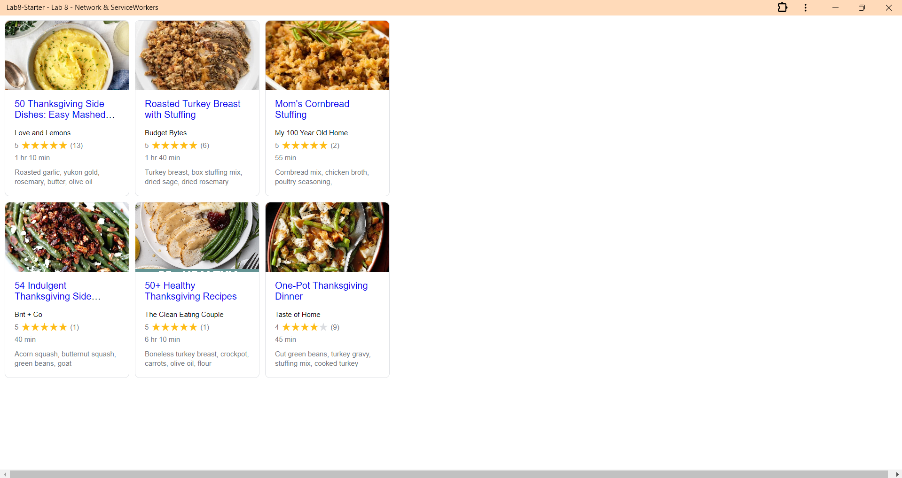

# Lab8-Starter

Work done by: Brian Morse

Graceful degradation and service workers are related since we started off with all of the javascript and now we are trying to account for situations for if there is slow or no internet to try to keep the app going, hence gracefully going down to a lower level to maintain usability to the best of our abilities. Service workers are essentially our way to keep code working smoother and quicker after we implemented our main functionality.

[https://brianmorse12604.github.io/Lab8-Starter/](https://brianmorse12604.github.io/Lab8-Starter/)

